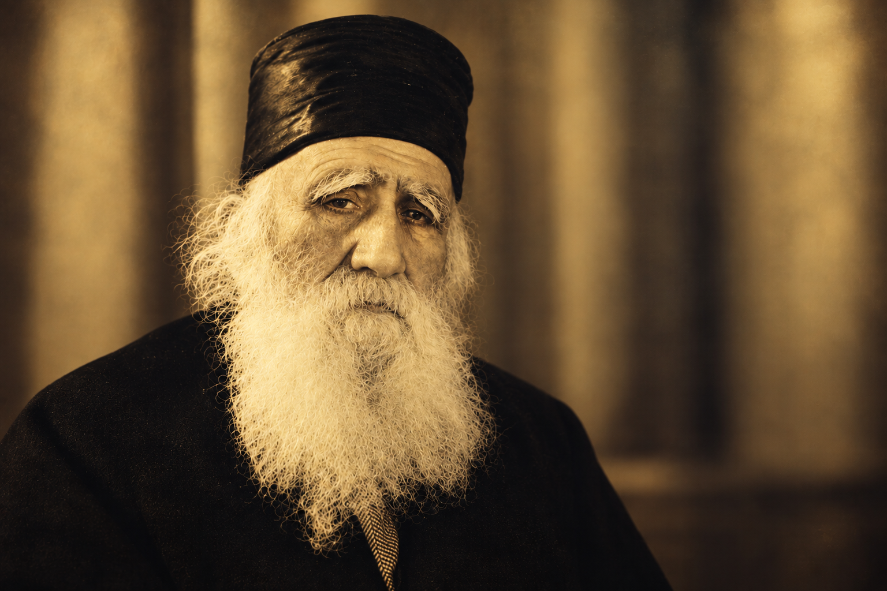

---
# Traducción del original hebreo "למה קוראים לי אפרים?" (2026-09-14). Mismo id de archivo que el
# hebreo para el emparejamiento automático (gemelo de idioma + hreflang).
# La portada no lleva texto, así que es la misma imagen que en hebreo. La foto dentro del relato
# es la foto original del Jajam Efraim HaCohen (familia), igual que en hebreo.
# Fecha: 20:00 hora de Israel (17:00Z) — programado por el propietario; isPublished lo excluye hasta entonces.
title: "¿Por qué me llamo Efraim?"
section: yoman
cover: ../../assets/covers/lama-korim-li-efraim.png
coverAlt: "Una vieja puerta de madera cerrada en un callejón de Bagdad al anochecer; una luz dorada se filtra por la rendija e ilumina el escalón de piedra; cielo azul profundo y una palmera al fondo"
date: 2026-09-14T17:00:00Z
excerpt: "Un muchacho de catorce años por las calles de Bagdad, que ya se había alejado del camino en el que creció. Un día vio en la calle al Ben Ish Jai, y corrió a casa."
---

Un muchacho de catorce años por las calles de Bagdad. 
Un muchacho que ya se había alejado del camino en el que creció.

El pelo le creció. La ropa cambió. Los amigos cambiaron.

Y entonces, un día, en la calle, vio al Rav. 
*El Ben Ish Jai.*

Y se estremeció.

Corrió a casa. Se afeitó el pelo largo, se cambió de ropa y salió.

Su madre le preguntó qué había pasado y adónde iba. Solo alcanzó a decir: "Voy a ver al Rav."

En la casa del Rav le dijeron: "El Rav no recibe hoy."

El muchacho ya se había dado la vuelta para irse.

Y entonces, desde dentro de la habitación, se oyó una voz: 
*"¿Efraim?"*

El Rav pidió que lo hicieran entrar. El muchacho entró.

La puerta se cerró.

¿Qué se dijo allí? 
Nadie lo sabe.

Pero cuando la puerta se abrió, *salió Efraim.*

Desde aquel día, los amigos de la calle no lo vieron más. Todo lo que había perdido en el estudio, lo recuperó. Año tras año.

Con el tiempo llegó a ser uno de los grandes sabios de Babilonia.

*El Jajam Efraim HaCohen.*

<figure class="inline-photo">

<figcaption>Jajam Efraim HaCohen, de bendita memoria</figcaption>

</figure>

El 3 de Tishrei es el aniversario de su fallecimiento.

Él es mi bisabuelo.

Su hijo, el Jajam Rafael Cohen, fue mi abuelo. Su hermano, el Jajam Shalom Cohen, fue director de la yeshivá Porat Yosef.

Desde que conozco esta historia, vuelvo a esa puerta.

A ese muchacho de catorce años que entró en la habitación *sin saber todavía quién iba a ser.*

> Y su nombre pasó a mí.

Con cariño, Efraim Atia

